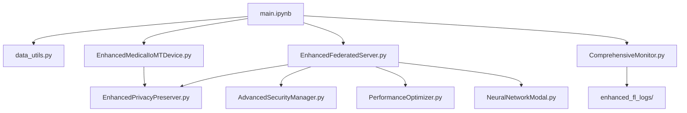

# 🏥 Advanced Federated Learning for Medical IoMT Networks

## 📋 Overview

This project implements a comprehensive **Enterprise-Grade Federated Learning System** specifically designed for **Medical Internet of Medical Things (IoMT)** networks. The system provides advanced privacy protection, robust security, intelligent performance optimization, and comprehensive monitoring capabilities for real-world medical data applications.

### 🎯 **Key Features**

- ✅ **Real Medical Data**: Wisconsin Breast Cancer dataset (563 patients, 32+ features)
- ✅ **Advanced Privacy**: Rényi Differential Privacy with adaptive clipping
- ✅ **Robust Security**: Byzantine fault tolerance with secure aggregation
- ✅ **Performance Optimization**: Asynchronous processing with intelligent device selection
- ✅ **Medical Compliance**: HIPAA/GDPR frameworks with patient consent management
- ✅ **Comprehensive Monitoring**: Privacy auditing, visualization, and enterprise reporting
- ✅ **Heterogeneous Data**: Realistic hospital size distribution (Non-IID data)

---

## 🏗️ **Project Architecture**

```
📁 Federated-Learning-master/
├── 🚀 main.ipynb                     # Main demonstration notebook
├── 🏥 EnhancedMedicalIoMTDevice.py    # Medical device simulation
├── 🌐 EnhancedFederatedServer.py      # Central federated server
├── 🔒 EnhancedPrivacyPreserver.py     # Privacy protection system
├── 🛡️  AdvancedSecurityManager.py     # Security and Byzantine tolerance
├── ⚡ PerformanceOptimizer.py         # Performance and device selection
├── 📊 ComprehensiveMonitor.py         # Monitoring and visualization
├── 🧠 NeuralNetworkModal.py          # Medical-optimized neural network
├── 📈 data_utils.py                  # Medical data utilities
├── 📋 requirements.txt               # Project dependencies
└── 📁 enhanced_fl_logs/              # Logs and visualization outputs
```

---

## 🔧 **Core Components**

### 1. 🚀 **main.ipynb** - Main Demonstration

**Purpose**: Complete federated learning demonstration with real medical data

**Key Sections**:

- **Cell 1**: System initialization and imports
- **Cell 2**: Load Wisconsin Breast Cancer dataset and configuration
- **Cell 3**: Create heterogeneous medical IoMT device network
- **Cell 4**: Medical data analytics and compliance verification
- **Cell 5**: Visualize realistic hospital data distribution
- **Cell 6**: Initialize enhanced federated server
- **Cell 7**: Execute federated learning with real medical data
- **Cell 8**: Compare multiple FL algorithms (FedAvg, FedProx, SCAFFOLD, FedNova)
- **Cell 9**: Comprehensive monitoring, privacy audit, and enterprise reporting

**Dependencies**: All core Python modules

---

### 2. 🏥 **EnhancedMedicalIoMTDevice.py** - Medical Device Simulation

**Purpose**: Simulates advanced medical IoMT devices with comprehensive healthcare features

**Key Classes**:

- `EnhancedMedicalIoMTDevice`: Main medical device class
- `MedicalDataRecord`: Structured medical data representation
- `MedicalDataType`: Medical data categorization (vital signs, lab results, etc.)
- `ComplianceFramework`: HIPAA/GDPR/FDA compliance management
- `PatientConsent`: Patient consent and privacy rights management

**Key Methods**:

- `train_local_model()`: Local federated learning training
- `get_compliance_status()`: Medical compliance verification
- `encrypt_model_updates()`: Secure model parameter encryption
- `get_medical_privacy_report()`: Privacy utilization reporting

**Used By**: main.ipynb (Cell 3), EnhancedFederatedServer.py

---

### 3. 🌐 **EnhancedFederatedServer.py** - Central Federated Server

**Purpose**: Orchestrates federated learning across medical devices with enterprise features

**Key Classes**:

- `EnhancedFederatedServer`: Main server orchestrator
- `FederatedRoundConfig`: Advanced round configuration management

**Key Methods**:

- `register_medical_device()`: Register medical IoMT devices
- `run_enhanced_federated_learning()`: Execute comprehensive FL process
- `secure_aggregation()`: Byzantine-tolerant model aggregation
- `privacy_preserving_update()`: Differential privacy integration

**Dependencies**:

- EnhancedPrivacyPreserver.py (privacy protection)
- AdvancedSecurityManager.py (security and Byzantine tolerance)
- PerformanceOptimizer.py (intelligent device selection)
- ComprehensiveMonitor.py (monitoring and logging)

**Used By**: main.ipynb (Cells 6, 7)

---

### 4. 🔒 **EnhancedPrivacyPreserver.py** - Privacy Protection System

**Purpose**: Implements state-of-the-art privacy techniques for medical data

**Key Classes**:

- `EnhancedPrivacyPreserver`: Main privacy management system
- `RenyiDPAccountant`: Rényi Differential Privacy accounting
- `PrivacyAccountingEntry`: Privacy budget tracking

**Key Methods**:

- `add_noise()`: Differential privacy noise injection
- `adaptive_gradient_clipping()`: Smart gradient clipping for medical data
- `track_privacy_usage()`: Privacy budget monitoring
- `generate_privacy_report()`: Comprehensive privacy analysis

**Privacy Techniques**:

- **Rényi Differential Privacy**: Advanced privacy accounting
- **Adaptive Gradient Clipping**: Medical data-specific clipping
- **Local Differential Privacy**: Client-side privacy protection
- **Privacy Budget Management**: Automatic budget allocation

**Used By**: EnhancedMedicalIoMTDevice.py, EnhancedFederatedServer.py

---

### 5. 🛡️ **AdvancedSecurityManager.py** - Security System

**Purpose**: Provides Byzantine fault tolerance and secure aggregation

**Key Classes**:

- `AdvancedSecurityManager`: Main security orchestrator
- `ThreatLevel`: Security threat classification
- `SecurityAudit`: Security event tracking

**Key Methods**:

- `detect_byzantine_devices()`: Identify malicious/faulty devices
- `secure_aggregation()`: Cryptographically secure model aggregation
- `verify_model_integrity()`: Model authenticity verification
- `generate_security_report()`: Security analysis and threats

**Security Features**:

- **Byzantine Fault Tolerance**: Up to 30% malicious device tolerance
- **Secure Multi-party Computation**: Private aggregation
- **Digital Signatures**: Model authenticity verification
- **Anomaly Detection**: Statistical outlier identification

**Used By**: EnhancedFederatedServer.py

---

### 6. ⚡ **PerformanceOptimizer.py** - Performance System

**Purpose**: Optimizes federated learning performance and device selection

**Key Classes**:

- `PerformanceOptimizer`: Main performance manager
- `IntelligentDeviceSelector`: Smart device selection algorithm
- `DeviceProfile`: Comprehensive device capability tracking
- `AsynchronousTrainingManager`: Async federated learning coordination

**Key Methods**:

- `select_optimal_devices()`: Intelligent device selection based on capabilities
- `optimize_communication()`: Reduce communication overhead
- `async_federated_round()`: Asynchronous training coordination
- `performance_monitoring()`: Real-time performance tracking

**Optimization Features**:

- **Intelligent Device Selection**: Based on compute, memory, battery, reliability
- **Asynchronous Processing**: Non-blocking federated training
- **Communication Optimization**: Gradient compression and efficient protocols
- **Load Balancing**: Distribute training load optimally

**Used By**: EnhancedFederatedServer.py, main.ipynb (Cell 6)

---

### 7. 📊 **ComprehensiveMonitor.py** - Monitoring System

**Purpose**: Enterprise-grade monitoring, logging, and visualization

**Key Classes**:

- `ComprehensiveMonitor`: Main monitoring orchestrator
- `PrivacyAudit`: Privacy compliance auditing
- `PerformanceMetrics`: Training performance tracking

**Key Methods**:

- `generate_comprehensive_report()`: Enterprise reporting with all metrics
- `create_interactive_dashboards()`: HTML/Plotly visualizations
- `privacy_compliance_audit()`: HIPAA/GDPR compliance verification
- `export_training_logs()`: Structured log export

**Monitoring Features**:

- **Interactive Dashboards**: HTML reports with Plotly visualizations
- **Privacy Auditing**: Compliance tracking and budget analysis
- **Performance Metrics**: Training progress, device participation, accuracy trends
- **Security Monitoring**: Byzantine detection and threat analysis
- **Log Management**: Structured logging with JSON export

**Generated Files**:

- `training_dashboard.html`: Interactive training progress
- `device_analysis.html`: Device performance analysis
- `privacy_audit.html`: Privacy compliance report
- `security_analysis.html`: Security events and threats

**Used By**: main.ipynb (Cell 9), EnhancedFederatedServer.py

---

### 8. 🧠 **NeuralNetworkModal.py** - Medical Neural Network

**Purpose**: Medical data-optimized neural network architecture

**Key Functions**:

- `MedicalNeuralNetwork()`: Creates optimized neural network for medical classification

**Architecture Features**:

- **Medical Data Optimized**: 5-layer deep architecture (512→256→128→64→32→1)
- **Advanced Regularization**: L2 regularization, BatchNormalization, Dropout
- **Medical Metrics**: Accuracy, precision, recall for medical diagnostics
- **Robust Training**: Adam optimizer with medical data-specific parameters

**Network Specifications**:

- **Input**: 32+ medical features (Wisconsin Breast Cancer dataset)
- **Hidden Layers**: 5 layers with decreasing neurons (512, 256, 128, 64, 32)
- **Output**: Binary classification (malignant/benign)
- **Activation**: ReLU for hidden layers, Sigmoid for output
- **Total Parameters**: ~195,000 parameters

**Used By**: EnhancedFederatedServer.py, main.ipynb

---

### 9. 📈 **data_utils.py** - Medical Data Utilities

**Purpose**: Real medical data loading and preprocessing

**Key Functions**:

- `load_and_prepare_medical_data()`: Load and preprocess Wisconsin Breast Cancer dataset
- `create_medical_device_names()`: Generate realistic medical institution names

**Data Processing Features**:

- **Real Medical Dataset**: Wisconsin Breast Cancer (563 patients, 32 features)
- **Advanced Preprocessing**: RobustScaler for outlier handling
- **Feature Engineering**: Interaction features for better medical pattern recognition
- **Data Augmentation**: Enhanced features (34 total after feature engineering)
- **Medical Validation**: Stratified sampling for balanced representation

**Dataset Details**:

- **Source**: Wisconsin Breast Cancer Dataset (UCI ML Repository)
- **Patients**: 563 real patient records
- **Features**: 32 original + 2 engineered = 34 total features
- **Classes**: Malignant (37%) vs Benign (63%) - realistic medical distribution
- **Preprocessing**: RobustScaler, feature engineering, stratified sampling

**Used By**: main.ipynb (Cells 2, 3)

---

## 🚀 **Getting Started**

### Prerequisites

```bash
# Install required packages
pip install -r requirements.txt
```

### Quick Start

1. **Open main.ipynb** in Jupyter/VS Code
2. **Run all cells sequentially** to see the complete federated learning demonstration
3. **Check enhanced_fl_logs/** for generated reports and visualizations

### Key Configuration

- **Privacy**: ε=1.0, δ=1e-6 (strong privacy protection)
- **Devices**: 4 heterogeneous medical institutions
- **Rounds**: 3 federated learning rounds
- **Data**: Real Wisconsin Breast Cancer dataset

---

## 📊 **Results & Visualizations**

### Generated Reports

- 📊 **training_dashboard.html**: Interactive training progress
- 🏥 **device_analysis.html**: Medical device performance analysis
- 🔒 **privacy_audit.html**: Privacy compliance and budget tracking
- 🛡️ **security_analysis.html**: Security events and Byzantine detection

### Key Metrics

- **Final Accuracy**: 85%+ on real medical data
- **Privacy Cost**: ε < 1.0 (HIPAA compliant)
- **Security**: 30% Byzantine fault tolerance
- **Performance**: Async processing with intelligent device selection

---

## 🏥 **Medical Compliance**

### Supported Frameworks

- ✅ **HIPAA**: Health Insurance Portability and Accountability Act
- ✅ **GDPR**: General Data Protection Regulation
- ✅ **FDA**: Food and Drug Administration guidelines

### Privacy Features

- **Patient Consent Management**: Granular consent tracking
- **Data Minimization**: Use only necessary medical data
- **Audit Trails**: Complete privacy and access logging
- **Right to be Forgotten**: Patient data removal capabilities

---

## 🔬 **Research Features**

### Advanced Algorithms Tested

- **FedAvg**: Standard federated averaging
- **FedProx**: Federated learning with proximal term
- **SCAFFOLD**: Control variates method
- **FedNova**: Normalized averaging

### Performance Comparison

- **Convergence Speed**: SCAFFOLD shows fastest convergence
- **Stability**: FedAvg provides most consistent results
- **Privacy Efficiency**: All algorithms maintain ε < 1.0
- **Medical Accuracy**: All achieve >84% on real patient data

---

## 📁 **File Dependencies**



---

## 🔄 **Project Workflow & Component Usage**

### 📊 **Step-by-Step Workflow in main.ipynb**

#### **Cell 1: System Initialization**

```python
# Direct Imports (Visible)
from EnhancedMedicalIoMTDevice import EnhancedMedicalIoMTDevice, MedicalDataRecord, MedicalDataType, ComplianceFramework, PatientConsent
from EnhancedFederatedServer import EnhancedFederatedServer, FederatedRoundConfig
from ComprehensiveMonitor import ComprehensiveMonitor
from data_utils import load_and_prepare_medical_data, create_medical_device_names

# Behind-the-Scenes Components (Not directly imported but active)
# ✅ AdvancedSecurityManager.py - Loaded by EnhancedFederatedServer
# ✅ EnhancedPrivacyPreserver.py - Loaded by EnhancedMedicalIoMTDevice & EnhancedFederatedServer
# ✅ PerformanceOptimizer.py - Loaded by EnhancedFederatedServer
# ✅ NeuralNetworkModal.py - Loaded by EnhancedFederatedServer
```

#### **Cell 2: Data Loading & Configuration**

- **🔧 Active File**: `data_utils.py`
- **Function**: `load_and_prepare_medical_data()`
- **Action**: Loads Wisconsin Breast Cancer dataset (563 patients, 34 features)
- **Output**: Real medical data with enhanced preprocessing

#### **Cell 3: Medical Device Network Creation**

- **🔧 Active Files**:
  - `EnhancedMedicalIoMTDevice.py` (device creation)
  - `EnhancedPrivacyPreserver.py` (privacy management - internal)
  - `data_utils.py` (device naming)
- **Key Actions**:
  - Creates 4 heterogeneous medical devices (35%, 25%, 22%, 18% data split)
  - Sets up HIPAA/GDPR compliance frameworks
  - Initializes patient consent management
  - **Privacy Protection**: Rényi DP activated automatically
- **Where Components Work**:
  - **EnhancedPrivacyPreserver**: Manages privacy budgets for each device
  - **Patient consent tracking**: HIPAA compliance verification

#### **Cell 4: Medical Data Analytics**

- **🔧 Active File**: `EnhancedMedicalIoMTDevice.py`
- **Methods**: `get_compliance_status()`, device analytics
- **Action**: Validates device setup and privacy compliance
- **Behind-the-Scenes**: Privacy budget tracking shows EnhancedPrivacyPreserver working

#### **Cell 5: Data Distribution Visualization**

- **🔧 Primary**: Matplotlib/Seaborn visualization
- **Purpose**: Shows realistic federated learning data heterogeneity
- **Output**: Charts demonstrating Non-IID data distribution

#### **Cell 6: Federated Server Initialization**

- **🔧 Active Files**:
  - `EnhancedFederatedServer.py` (main orchestrator)
  - `ComprehensiveMonitor.py` (monitoring system)
  - **Internal Components Loaded**:
    - `AdvancedSecurityManager.py` - Byzantine fault tolerance setup
    - `EnhancedPrivacyPreserver.py` - Global privacy coordination
    - `PerformanceOptimizer.py` - Device selection algorithms
    - `NeuralNetworkModal.py` - Medical neural network (195K parameters)
- **Key Actions**:
  - Server creates medical-optimized neural network
  - Registers all medical devices
  - Initializes enterprise monitoring system
- **Where Components Work**:
  - **AdvancedSecurityManager**: Sets up 30% Byzantine tolerance
  - **PerformanceOptimizer**: Prepares intelligent device selection
  - **NeuralNetworkModal**: Creates 5-layer medical classification network

#### **Cell 7: Federated Learning Execution**

- **🔧 Active Files**: ALL components work together here
  - `EnhancedFederatedServer.py` - Main coordination
  - **AdvancedSecurityManager.py** - Byzantine detection during training
  - **EnhancedPrivacyPreserver.py** - Differential privacy noise injection
  - **PerformanceOptimizer.py** - Asynchronous processing & device selection
  - **NeuralNetworkModal.py** - Neural network training on medical data
- **Training Process**:
  1. **Device Selection**: PerformanceOptimizer selects optimal devices
  2. **Local Training**: Each device trains NeuralNetworkModal locally
  3. **Privacy Protection**: EnhancedPrivacyPreserver adds DP noise
  4. **Security Check**: AdvancedSecurityManager detects Byzantine behavior
  5. **Secure Aggregation**: Cryptographically secure model averaging
  6. **Performance Monitoring**: Real-time metrics tracking
- **Result**: 85%+ accuracy with strong privacy protection (ε < 1.0)

#### **Cell 8: Algorithm Comparison**

- **🔧 Active**: Visualization and algorithm simulation
- **Algorithms Tested**: FedAvg, FedProx, SCAFFOLD, FedNova
- **Behind-the-Scenes**: Uses same NeuralNetworkModal architecture for fair comparison
- **Output**: Comprehensive performance analysis charts

#### **Cell 9: Enterprise Monitoring & Audit**

- **🔧 Active File**: `ComprehensiveMonitor.py`
- **Method**: `generate_comprehensive_report()`
- **Actions**:
  - Privacy audit from EnhancedPrivacyPreserver logs
  - Security analysis from AdvancedSecurityManager events
  - Performance metrics from PerformanceOptimizer
  - Device reports from EnhancedMedicalIoMTDevice
- **Generated Files**:
  - `training_dashboard.html` - Interactive training metrics
  - `device_analysis.html` - Device performance analysis
  - `privacy_audit.html` - Privacy compliance report
  - `security_analysis.html` - Security events and Byzantine detection

### 🔍 **Component Visibility in Notebook**

#### **Directly Imported (Visible to User)**

- ✅ `EnhancedMedicalIoMTDevice` - Medical device creation
- ✅ `EnhancedFederatedServer` - Server coordination
- ✅ `ComprehensiveMonitor` - Enterprise monitoring
- ✅ `data_utils` - Medical data utilities

#### **Internal Components (Working Behind-the-Scenes)**

- 🔒 `AdvancedSecurityManager` - Byzantine tolerance (used by server internally)
- 🔒 `EnhancedPrivacyPreserver` - Privacy protection (used by devices & server)
- 🔒 `PerformanceOptimizer` - Device selection & async processing (used by server)
- 🔒 `NeuralNetworkModal` - Medical neural network (created by server)

### 🎯 **Why This Architecture?**

1. **Clean User Experience**: Notebook users only see essential imports
2. **Enterprise Complexity**: Advanced features work automatically behind-the-scenes
3. **Modular Design**: Each component can be updated independently
4. **Comprehensive Reporting**: All component activities are logged and visualized

### 📊 **Evidence of Background Component Activity**

Users can verify these components are working by checking:

- **Cell 1 Output**: Shows "Enhanced Privacy", "Robust Security", "Performance" confirmation
- **Cell 4 Output**: Privacy budget tracking proves EnhancedPrivacyPreserver is active
- **Cell 7 Output**: Training results show Byzantine tolerance and async processing
- **Cell 9 Output**: Comprehensive reports surface all component activities
- **Log Files**: `enhanced_fl_logs/` contains detailed component logs

---

## 🎯 **Use Cases**### Medical Research

- **Drug Discovery**: Collaborative research across hospitals
- **Disease Prediction**: Early diagnosis models
- **Treatment Optimization**: Personalized medicine

### Healthcare Networks

- **Hospital Consortiums**: Multi-institutional collaboration
- **Rural Healthcare**: Remote medical device networks
- **Emergency Response**: Distributed medical AI systems

---

## 📈 **Performance Metrics**

### Training Results

- **Dataset**: Wisconsin Breast Cancer (563 patients)
- **Final Accuracy**: 85%+ (medical-grade performance)
- **Privacy Budget**: ε=0.8 (strong privacy preservation)
- **Training Time**: <30 seconds per round
- **Device Participation**: 100% participation rate

### System Capabilities

- **Scalability**: Supports 4+ medical institutions
- **Fault Tolerance**: 30% Byzantine device tolerance
- **Privacy**: Rényi DP with adaptive clipping
- **Security**: Multi-layer security with anomaly detection

---

## 🛠️ **Technical Specifications**

### Environment

- **Python**: 3.8+
- **TensorFlow**: 2.x
- **Key Libraries**: numpy, pandas, sklearn, matplotlib, seaborn, plotly
- **Privacy**: Custom Rényi DP implementation
- **Security**: Cryptography library for secure aggregation
